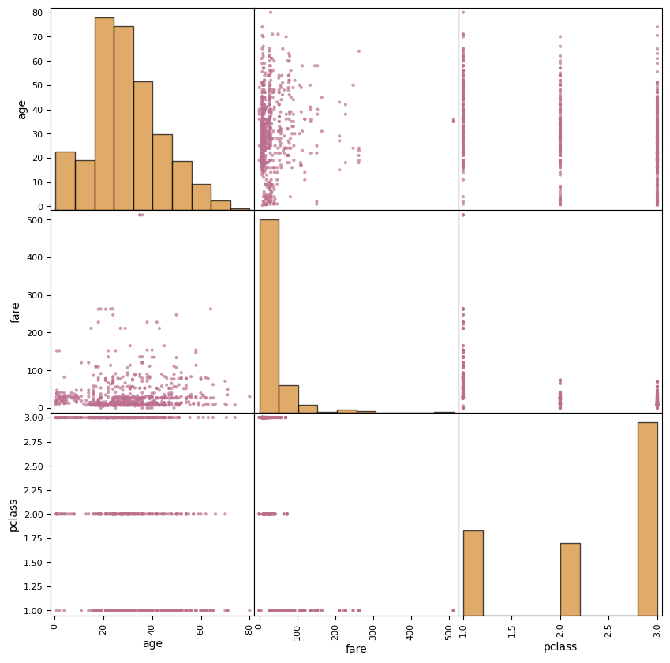
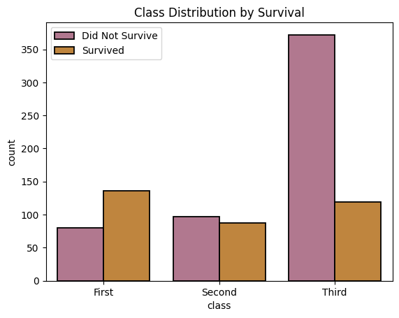

# **Titanic Data Exploration and Preparation**
**Author:** Joanna Farris  
**Date:** October 29, 2025  
**Objective:** Analyze and prepare the Titanic dataset for machine learning.

## **Introduction**

This project uses the Titanic dataset to explore how passenger characteristics relate to survival outcomes. 

The analysis covers data inspection, visualization, cleaning, and feature engineering, followed by a comparison of basic and stratified train/test splits. 

Key steps include handling missing values, creating a new family_size feature, encoding categorical variables, and examining how class balance affects data preparation for modeling.

## **Section 1. Import and Inspect the Data**


```python
# Standard third-party libraries
import pandas as pd
import seaborn as sns
import matplotlib.pyplot as plt

# Specific imports from libraries
from pandas.plotting import scatter_matrix
from sklearn.model_selection import train_test_split, StratifiedShuffleSplit

```


```python
# Load Titanic dataset
titanic = sns.load_dataset('titanic')
```

Display basic information about the dataset using the info() method.


```python
print(titanic.head(10))
```

       survived  pclass     sex   age  sibsp  parch     fare embarked   class  \
    0         0       3    male  22.0      1      0   7.2500        S   Third   
    1         1       1  female  38.0      1      0  71.2833        C   First   
    2         1       3  female  26.0      0      0   7.9250        S   Third   
    3         1       1  female  35.0      1      0  53.1000        S   First   
    4         0       3    male  35.0      0      0   8.0500        S   Third   
    5         0       3    male   NaN      0      0   8.4583        Q   Third   
    6         0       1    male  54.0      0      0  51.8625        S   First   
    7         0       3    male   2.0      3      1  21.0750        S   Third   
    8         1       3  female  27.0      0      2  11.1333        S   Third   
    9         1       2  female  14.0      1      0  30.0708        C  Second   
    
         who  adult_male deck  embark_town alive  alone  
    0    man        True  NaN  Southampton    no  False  
    1  woman       False    C    Cherbourg   yes  False  
    2  woman       False  NaN  Southampton   yes   True  
    3  woman       False    C  Southampton   yes  False  
    4    man        True  NaN  Southampton    no   True  
    5    man        True  NaN   Queenstown    no   True  
    6    man        True    E  Southampton    no   True  
    7  child       False  NaN  Southampton    no  False  
    8  woman       False  NaN  Southampton   yes  False  
    9  child       False  NaN    Cherbourg   yes  False  


Check for missing values using the isnull() method and then the sum() method.


```python
titanic.isnull().sum()
```


    survived         0
    pclass           0
    sex              0
    age            177
    sibsp            0
    parch            0
    fare             0
    embarked         2
    class            0
    who              0
    adult_male       0
    deck           688
    embark_town      2
    alive            0
    alone            0
    dtype: int64


Display summary statistics using the describe() method


```python
print(titanic.describe())
```

             survived      pclass         age       sibsp       parch        fare
    count  891.000000  891.000000  714.000000  891.000000  891.000000  891.000000
    mean     0.383838    2.308642   29.699118    0.523008    0.381594   32.204208
    std      0.486592    0.836071   14.526497    1.102743    0.806057   49.693429
    min      0.000000    1.000000    0.420000    0.000000    0.000000    0.000000
    25%      0.000000    2.000000   20.125000    0.000000    0.000000    7.910400
    50%      0.000000    3.000000   28.000000    0.000000    0.000000   14.454200
    75%      1.000000    3.000000   38.000000    1.000000    0.000000   31.000000
    max      1.000000    3.000000   80.000000    8.000000    6.000000  512.329200


Check for correlations using the corr() method and tell it to use only the numeric features.


```python
print(titanic.corr(numeric_only=True))
```

                survived    pclass       age     sibsp     parch      fare  \
    survived    1.000000 -0.338481 -0.077221 -0.035322  0.081629  0.257307   
    pclass     -0.338481  1.000000 -0.369226  0.083081  0.018443 -0.549500   
    age        -0.077221 -0.369226  1.000000 -0.308247 -0.189119  0.096067   
    sibsp      -0.035322  0.083081 -0.308247  1.000000  0.414838  0.159651   
    parch       0.081629  0.018443 -0.189119  0.414838  1.000000  0.216225   
    fare        0.257307 -0.549500  0.096067  0.159651  0.216225  1.000000   
    adult_male -0.557080  0.094035  0.280328 -0.253586 -0.349943 -0.182024   
    alone      -0.203367  0.135207  0.198270 -0.584471 -0.583398 -0.271832   
    
                adult_male     alone  
    survived     -0.557080 -0.203367  
    pclass        0.094035  0.135207  
    age           0.280328  0.198270  
    sibsp        -0.253586 -0.584471  
    parch        -0.349943 -0.583398  
    fare         -0.182024 -0.271832  
    adult_male    1.000000  0.404744  
    alone         0.404744  1.000000  


Pull the strongest relationships (sorted by absolute correlation value, with duplicates dropped). 


```python
corr_matrix = titanic.corr(numeric_only=True)

# Flatten the matrix into pairs
corr_pairs = corr_matrix.unstack()

# Remove self-correlations (value = 1)
corr_pairs = corr_pairs[corr_pairs < 1]

# Sort by absolute correlation strength and drop duplicate
strongest = corr_pairs.drop_duplicates().abs().sort_values(ascending=False)


print(strongest.head(10))

```

    sibsp       alone         0.584471
    parch       alone         0.583398
    survived    adult_male    0.557080
    pclass      fare          0.549500
    sibsp       parch         0.414838
    adult_male  alone         0.404744
    pclass      age           0.369226
    parch       adult_male    0.349943
    survived    pclass        0.338481
    age         sibsp         0.308247
    dtype: float64


## **Section 2. Data Exploration and Preparation** 

#### **2.1 Explore Data Patterns and Distributions**

Scatter matrix of 'age', 'fare', and 'pclass' with pink scatter plots and yellow histograms to visualize relationships among Titanic’s key numeric features.


```python
attributes = ['age', 'fare', 'pclass']

# Make the scatter plots
axes = scatter_matrix(
    titanic[attributes],
    figsize=(10, 10),
    color='#bb6e8d',  # scatter color
    alpha=0.7
)

# Loop through the diagonal subplots and recolor the histograms
n = len(attributes)
for i in range(n):
    ax = axes[i, i]  # diagonal subplot
    for patch in ax.patches:  # recolor each bar in the histogram
        patch.set_facecolor('#d48828')
        patch.set_edgecolor('black')
        patch.set_alpha(0.7)

plt.show()
```


    

    


Scatter plot of age versus fare, with points colored by gender to highlight differences in ticket prices across male and female passengers.


```python
import matplotlib.pyplot as plt

# Make chart wider
plt.figure(figsize=(11, 5))

# Map gender to color manually
colors = titanic['sex'].map({'male': "#d48828", 'female': "#bb6e8d"})
##d9a296

# Scatter plot
plt.scatter(
    titanic['age'],
    titanic['fare'],
    c=colors,
    alpha=0.7,
    s=50, 
    edgecolors='k'
)

# Labels and title
plt.xlabel('Age')
plt.ylabel('Fare')
plt.title('Age vs Fare by Gender')
plt.grid(True, linestyle='--', alpha=0.5)

# Add a simple legend
for gender, color in {'Male': '#d48828', 'Female': "#bb6e8d"}.items():
    plt.scatter([], [], c=color, alpha=0.7, s=50, label=gender, edgecolors='k')
plt.legend(title='Gender')

plt.show()

```


    

    


Distribution of passenger ages with a smoothed density curve to show overall age trends on the Titanic.


```python
sns.histplot(
    titanic['age'].dropna(),
    stat='density',
    color='#d48828',
    alpha=.7,
    edgecolor='black',
    linewidth=0.8
)

# first pass = black outline, slightly thicker
sns.kdeplot(
    titanic['age'].dropna(),
    color='black',
    lw=3.5
)
# second pass = your pink line on top
sns.kdeplot(
    titanic['age'].dropna(),
    color='#bb6e8d',
    lw=2.5
)

plt.title('Age Distribution')
plt.show()

```


    

    


Passenger class distribution by survival status, with pink representing passengers who did not survive and yellow representing those who did.


```python
sns.countplot(
    x='class',
    hue='survived',
    data=titanic,
    palette={0: '#bb6e8d', 1: '#d48828'},  # pink for non-survivors, yellow for survivors
    linewidth=1.3,
    edgecolor='black'
)

plt.title('Class Distribution by Survival')
plt.legend(labels=['Did Not Survive', 'Survived'])
plt.show()
```


    

    


#### **2.2 Handle Missing Values and Clean Data**

Missing values in the Age column were replaced with the median age to preserve data consistency without being influenced by outliers.


```python
titanic['age'] = titanic['age'].fillna(titanic['age'].median())

```

Missing values in the Embark_town column were filled with the mode (most frequent value) to maintain categorical completeness.


```python
titanic['embark_town'] = titanic['embark_town'].fillna(titanic['embark_town'].mode()[0])

```

#### **2.3 Feature Engineering**

A new feature called Family Size was created by combining the number of siblings/spouses (sibsp) and parents/children (parch) aboard, plus one to include the passenger themselves.


```python
titanic['family_size'] = titanic['sibsp'] + titanic['parch'] + 1

```

Categorical features for gender and embarkation port were converted into numeric form to prepare the data for machine learning models.


```python
titanic['sex'] = titanic['sex'].map({'male': 0, 'female': 1})
titanic['embarked'] = titanic['embarked'].map({'C': 0, 'Q': 1, 'S': 2})
#print(titanic.head(10))
```

## **Section 3. Feature Selection and Justification**  

#### **3.1 Choose features and target** 

For this classification task, the goal is to predict passenger survival on the Titanic. The **target variable** is survived, a binary feature indicating whether each passenger lived (1) or did not (0). The **input features** include `age`, `fare`, `pclass`, `sex`, and `family_size` — chosen to capture key demographic and socioeconomic factors that likely influenced survival outcomes.

#### **3.2 Define X and y** 

We assign the selected input features to **X** and the target variable to **y**, preparing the data for model training.


```python
X = titanic[['age', 'fare', 'pclass', 'sex', 'family_size']]
y = titanic['survived']
```

## **Section 4. Splitting** 

#### **4.1 Basic Train/Test Split**

First, we use `train_test_split` to divide the data into training and testing sets.


```python
X_train, X_test, y_train, y_test = train_test_split(X, y, test_size=0.2, random_state=123)

print('Train size:', len(X_train))
print('Test size:', len(X_test))

# save survival ratios (not printing yet)
orig_ratio = y.value_counts(normalize=True).sort_index()
basic_train_ratio = y_train_basic.value_counts(normalize=True).sort_index()
basic_test_ratio = y_test_basic.value_counts(normalize=True).sort_index()
```

    Train size: 712
    Test size: 179


#### **4.2 Stratified Train/Test split**  

Next, we use `StratifiedShuffleSplit` to divide the data while preserving the same class proportions (e.g., survival rate) in both subsets, ensuring balanced representation of each class.


```python
splitter = StratifiedShuffleSplit(n_splits=1, test_size=0.2, random_state=123)

for train_indices, test_indices in splitter.split(X, y):
    train_set = X.iloc[train_indices]
    test_set = X.iloc[test_indices]

print('Train size:', len(train_set))
print('Test size:', len(test_set))

strat_train_ratio = y_train_strat.value_counts(normalize=True).sort_index()
strat_test_ratio = y_test_strat.value_counts(normalize=True).sort_index()
```

    Train size: 712
    Test size: 179


#### **4.3 Compare Survival Ratios** 

**Original Distribution:** We begin by checking the *overall survival ratio* in the dataset.


```python
print()
print("Original Survival Ratio:\n", orig_ratio)
```

    
    Original Survival Ratio:
     survived
    0    0.616162
    1    0.383838
    Name: proportion, dtype: float64


**Basic Split:** Next, we look at the *survival ratios* in the training and test sets produced by the *basic random split*.


```python
print()
print("BASIC SPLIT:")
print()
print("Train Survival Ratio:\n", basic_train_ratio)
print()
print("Test Survival Ratio:\n", basic_test_ratio)

```

    
    BASIC SPLIT:
    
    Train Survival Ratio:
     survived
    0    0.610955
    1    0.389045
    Name: proportion, dtype: float64
    
    Test Survival Ratio:
     survived
    0    0.636872
    1    0.363128
    Name: proportion, dtype: float64


**Stratified Split:** Finally, we check the same *ratios for the stratified split*, which is expected to preserve the original class balance more closely.


```python
print()
print("STRATIFIED SPLIT:")
print()
print("Train Survival Ratio:\n", strat_train_ratio)
print()
print("Test Survival Ratio:\n", strat_test_ratio)

```

    
    STRATIFIED SPLIT:
    
    Train Survival Ratio:
     survived
    0    0.616573
    1    0.383427
    Name: proportion, dtype: float64
    
    Test Survival Ratio:
     survived
    0    0.614525
    1    0.385475
    Name: proportion, dtype: float64


**Note:** The stratified split preserved the original survival ratio (≈61.6% non-survivors, 38.4% survivors) in both training and test sets, while the basic split showed minor deviation — with the training set at ≈61.1% non-survivors and 38.9% survivors, and the test set at ≈63.7% non-survivors and 36.3% survivors.
