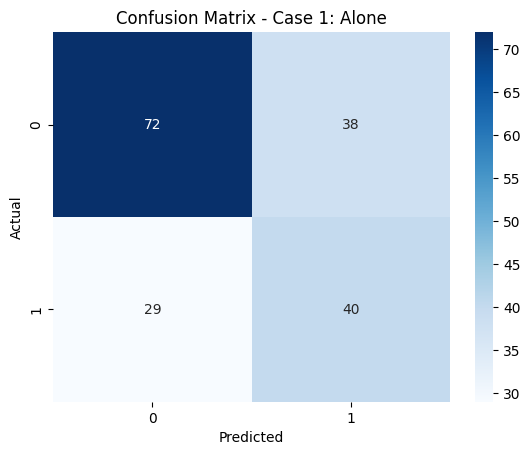
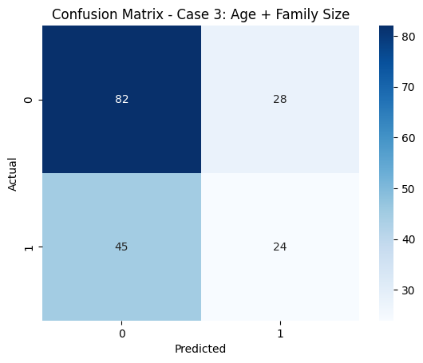
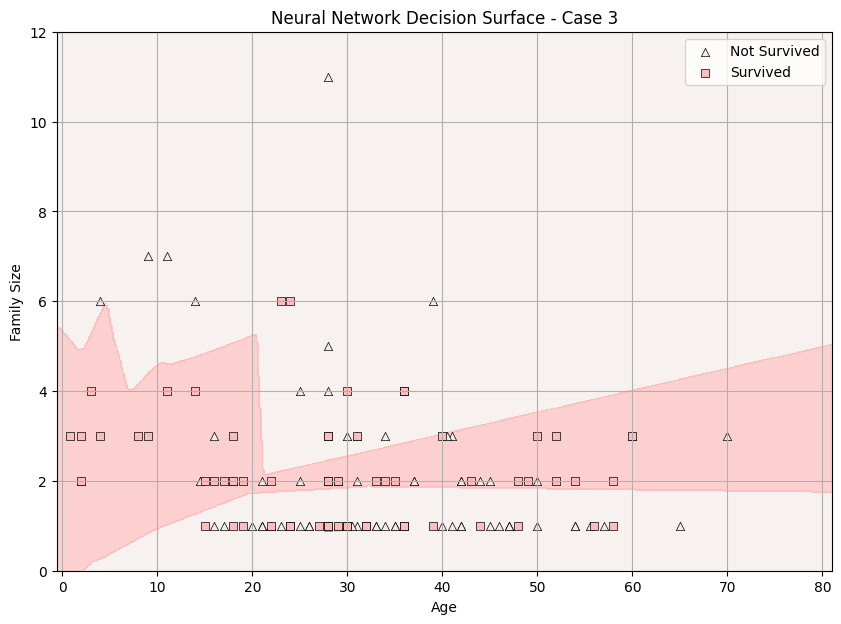

# **Titanic Data Exploration and Preparation**
**Author:** Joanna Farris  
**Date:** November 8, 2025  
**Objective:** Predict a Categorical Target and Evaluate Performance

## **Introduction**

In this project, we use the Titanic dataset to build and evaluate three classification models: a Decision Tree, a Support Vector Machine, and a Neural Network. Our goal is to compare their performance across three different feature sets and assess how effectively each model predicts passenger survival.

Below is a brief overview of the models used:

- **Decision Tree (DT)** – Splits the data into smaller groups using simple decision rules, forming a flowchart-like structure. Easy to interpret and quick to train, but prone to overfitting if the tree grows too deep.

- **Support Vector Machine (SVM)** – Finds the boundary (hyperplane) that best separates the classes. Performs well with complex data and smaller datasets, especially when a clear margin exists between classes, though it can be computationally expensive.

- **Neural Network (NN)** – Uses layers of interconnected neurons to learn complex and non-linear patterns. Powerful and flexible, but requires more data and careful tuning to avoid overfitting.


## **Section 1. Import and Inspect the Data**


```python
# all imports at the top, organized
import pandas as pd
import seaborn as sns
import matplotlib.pyplot as plt
import numpy as np
from matplotlib.colors import ListedColormap
from sklearn.model_selection import StratifiedShuffleSplit
from sklearn.tree import DecisionTreeClassifier, plot_tree
from sklearn.svm import SVC
from sklearn.neural_network import MLPClassifier
from sklearn.metrics import classification_report, confusion_matrix
```


```python
# Load Titanic dataset
titanic = sns.load_dataset('titanic')
# Display a few records to verify
titanic.head()
```


<div>
<style scoped>
    .dataframe tbody tr th:only-of-type {
        vertical-align: middle;
    }

    .dataframe tbody tr th {
        vertical-align: top;
    }

    .dataframe thead th {
        text-align: right;
    }
</style>
<table border="1" class="dataframe">
  <thead>
    <tr style="text-align: right;">
      <th></th>
      <th>survived</th>
      <th>pclass</th>
      <th>sex</th>
      <th>age</th>
      <th>sibsp</th>
      <th>parch</th>
      <th>fare</th>
      <th>embarked</th>
      <th>class</th>
      <th>who</th>
      <th>adult_male</th>
      <th>deck</th>
      <th>embark_town</th>
      <th>alive</th>
      <th>alone</th>
    </tr>
  </thead>
  <tbody>
    <tr>
      <th>0</th>
      <td>0</td>
      <td>3</td>
      <td>male</td>
      <td>22.0</td>
      <td>1</td>
      <td>0</td>
      <td>7.2500</td>
      <td>S</td>
      <td>Third</td>
      <td>man</td>
      <td>True</td>
      <td>NaN</td>
      <td>Southampton</td>
      <td>no</td>
      <td>False</td>
    </tr>
    <tr>
      <th>1</th>
      <td>1</td>
      <td>1</td>
      <td>female</td>
      <td>38.0</td>
      <td>1</td>
      <td>0</td>
      <td>71.2833</td>
      <td>C</td>
      <td>First</td>
      <td>woman</td>
      <td>False</td>
      <td>C</td>
      <td>Cherbourg</td>
      <td>yes</td>
      <td>False</td>
    </tr>
    <tr>
      <th>2</th>
      <td>1</td>
      <td>3</td>
      <td>female</td>
      <td>26.0</td>
      <td>0</td>
      <td>0</td>
      <td>7.9250</td>
      <td>S</td>
      <td>Third</td>
      <td>woman</td>
      <td>False</td>
      <td>NaN</td>
      <td>Southampton</td>
      <td>yes</td>
      <td>True</td>
    </tr>
    <tr>
      <th>3</th>
      <td>1</td>
      <td>1</td>
      <td>female</td>
      <td>35.0</td>
      <td>1</td>
      <td>0</td>
      <td>53.1000</td>
      <td>S</td>
      <td>First</td>
      <td>woman</td>
      <td>False</td>
      <td>C</td>
      <td>Southampton</td>
      <td>yes</td>
      <td>False</td>
    </tr>
    <tr>
      <th>4</th>
      <td>0</td>
      <td>3</td>
      <td>male</td>
      <td>35.0</td>
      <td>0</td>
      <td>0</td>
      <td>8.0500</td>
      <td>S</td>
      <td>Third</td>
      <td>man</td>
      <td>True</td>
      <td>NaN</td>
      <td>Southampton</td>
      <td>no</td>
      <td>True</td>
    </tr>
  </tbody>
</table>
</div>


## **Section 2. Data Exploration and Preparation** 

#### **2.1 Handle Missing Values and Clean Data**

Impute missing values for age using the median:


```python
median_age = titanic['age'].median()
titanic['age'] = titanic['age'].fillna(median_age)
```

Fill in missing values for embark_town using the mode:


```python
mode_embark = titanic['embark_town'].mode()[0]
titanic['embark_town'] = titanic['embark_town'].fillna(mode_embark)
```

#### **2.2 Feature Engineering**

Create any new features that might be helpful for the model from the existing data.   

Add family_size - number of family members on board. Count sibsp (number of siblings or spouses on board), parch (number of parents or children on board), and 1 to count the individual. 


```python
# Create new feature
titanic['family_size'] = titanic['sibsp'] + titanic['parch'] + 1

# Map categories to numeric values
titanic['sex'] = titanic['sex'].map({'male': 0, 'female': 1})
titanic['embarked'] = titanic['embarked'].map({'C': 0, 'Q': 1, 'S': 2})
titanic['alone'] = titanic['alone'].astype(int)
```

## **Section 3. Feature Selection and Justification** 

#### **3.1 Choose features and target**

**Case 1**  
- Input feature: `alone`  
- Target: `survived`

**Case 2**  
- Input feature: `age`  
- Target: `survived`

**Case 3**  
- Input features: `age`, `family_size`  
- Target: `survived`

Case 3 satisfies the requirement to include at least one model using two or more input features.


#### **3.2 Define X (features) and y (target)**  


```python
# Case 1: Feature = alone

# Select the feature 'alone' as input
X1 = titanic[['alone']]

# Select 'survived' as the target for the same rows
y1 = titanic['survived']
```


```python
# Case 2: Feature = age (drop if na or not available)

# Select the feature 'age', but drop rows where age is missing
X2 = titanic[['age']].dropna()

# Select the matching 'survived' values using the same index
y2 = titanic.loc[X2.index, 'survived']
```


```python
# Case 3: Features = Age + Family Size (drop if na or not available)

# Select both 'age' and 'family_size', and drop rows where missing (na)
X3 = titanic[['age', 'family_size']].dropna()

# Select the corresponding 'survived' values for those rows
y3 = titanic.loc[X3.index, 'survived']
```

### **Reflection 3:** Feature Selection

These features were chosen to give three different levels of information.  
- **alone** is a very simple yes/no variable, so it works as a basic starting point.  
- **age** adds a continuous feature that could matter for survival patterns.  
- **age + family_size** includes more context by combining two pieces of information instead of one.

There are definitely features in the Titanic dataset that are more directly related to survival. For example, sex and passenger class are usually the strongest predictors because they line up with who actually got access to lifeboats. Compared to those, the three features here are more limited, but they still let us explore how feature choice changes the setup of the problem.

## **Section 4. Train a Classification Model (Decision Tree)**
 

#### **4.1 Split the Data**
StratifiedShuffleSplit ensures that both training and test sets have a similar proportion of each class (survived = 0 or 1). 


```python
# Case 1: Feature = alone
splitter1 = StratifiedShuffleSplit(n_splits=1, test_size=0.2, random_state=123)
for train_idx1, test_idx1 in splitter1.split(X1, y1):

    X1_train = X1.iloc[train_idx1]
    X1_test  = X1.iloc[test_idx1]
    y1_train = y1.iloc[train_idx1]
    y1_test  = y1.iloc[test_idx1]

print('Case 1 - Alone:')
print('Train size:', len(X1_train), '| Test size:', len(X1_test))
```

    Case 1 - Alone:
    Train size: 712 | Test size: 179


```python
# Case 2: Feature = age
splitter2 = StratifiedShuffleSplit(n_splits=1, test_size=0.2, random_state=123)
for train_idx2, test_idx2 in splitter2.split(X2, y2):
    X2_train = X2.iloc[train_idx2]
    X2_test  = X2.iloc[test_idx2]
    y2_train = y2.iloc[train_idx2]
    y2_test  = y2.iloc[test_idx2]

print('Case 2 - Age:')
print('Train size:', len(X2_train), '| Test size:', len(X2_test))
```

    Case 2 - Age:
    Train size: 712 | Test size: 179


```python
# Case 3: Features = age + family_size
splitter3 = StratifiedShuffleSplit(n_splits=1, test_size=0.2, random_state=123)
for train_idx3, test_idx3 in splitter3.split(X3, y3):
    X3_train = X3.iloc[train_idx3]
    X3_test  = X3.iloc[test_idx3]
    y3_train = y3.iloc[train_idx3]
    y3_test  = y3.iloc[test_idx3]

print('Case 3 - Age + Family Size:')
print('Train size:', len(X3_train), '| Test size:', len(X3_test))

```

    Case 3 - Age + Family Size:
    Train size: 712 | Test size: 179


#### **4.2 Create and Train Model (Decision Tree)**


```python
# CASE 1: Decision Tree using alone
tree_model1 = DecisionTreeClassifier()
tree_model1.fit(X1_train, y1_train)
print("Model trained.")
```

    Model trained.


```python
# CASE 2: Decision Tree using age
tree_model2 = DecisionTreeClassifier()
tree_model2.fit(X2_train, y2_train)
print("Model trained.")
```

    Model trained.


```python
# CASE 3: Decision Tree using age and family_size
tree_model3 = DecisionTreeClassifier()
tree_model3.fit(X3_train, y3_train)
print("Model trained.")
```

    Model trained.


#### **4.3 Predict and Evaluate Model Performance**


```python
# Predict on training data
y1_pred = tree_model1.predict(X1_train)
print("Results for Decision Tree on training data (Case 1 - alone):")
print(classification_report(y1_train, y1_pred))

# Predict on test data
y1_test_pred = tree_model1.predict(X1_test)
print("Results for Decision Tree on test data (Case 1 - alone):")
print(classification_report(y1_test, y1_test_pred))
```

    Results for Decision Tree on training data (Case 1 - alone):
                  precision    recall  f1-score   support
    
               0       0.69      0.69      0.69       439
               1       0.50      0.51      0.51       273
    
        accuracy                           0.62       712
       macro avg       0.60      0.60      0.60       712
    weighted avg       0.62      0.62      0.62       712
    
    Results for Decision Tree on test data (Case 1 - alone):
                  precision    recall  f1-score   support
    
               0       0.71      0.65      0.68       110
               1       0.51      0.58      0.54        69
    
        accuracy                           0.63       179
       macro avg       0.61      0.62      0.61       179
    weighted avg       0.64      0.63      0.63       179
    


```python
# Predict on training data
y2_pred = tree_model2.predict(X2_train)
print("Results for Decision Tree on training data (Case 2 - age):")
print(classification_report(y2_train, y2_pred))

# Predict on test data
y2_test_pred = tree_model2.predict(X2_test)
print("Results for Decision Tree on test data (Case 2 - age):")
print(classification_report(y2_test, y2_test_pred))
```

    Results for Decision Tree on training data (Case 2 - age):
                  precision    recall  f1-score   support
    
               0       0.68      0.92      0.78       439
               1       0.69      0.29      0.41       273
    
        accuracy                           0.68       712
       macro avg       0.68      0.61      0.60       712
    weighted avg       0.68      0.68      0.64       712
    
    Results for Decision Tree on test data (Case 2 - age):
                  precision    recall  f1-score   support
    
               0       0.63      0.89      0.74       110
               1       0.50      0.17      0.26        69
    
        accuracy                           0.61       179
       macro avg       0.57      0.53      0.50       179
    weighted avg       0.58      0.61      0.55       179
    


```python
# Predict on training data
y3_pred = tree_model3.predict(X3_train)
print("Results for Decision Tree on training data (Case 3 - age + family_size):")
print(classification_report(y3_train, y3_pred))

# Predict on test data
y3_test_pred = tree_model3.predict(X3_test)
print("Results for Decision Tree on test data (Case 3 - age + family_size):")
print(classification_report(y3_test, y3_test_pred))
```

    Results for Decision Tree on training data (Case 3 - age + family_size):
                  precision    recall  f1-score   support
    
               0       0.77      0.90      0.83       439
               1       0.77      0.56      0.65       273
    
        accuracy                           0.77       712
       macro avg       0.77      0.73      0.74       712
    weighted avg       0.77      0.77      0.76       712
    
    Results for Decision Tree on test data (Case 3 - age + family_size):
                  precision    recall  f1-score   support
    
               0       0.65      0.75      0.69       110
               1       0.46      0.35      0.40        69
    
        accuracy                           0.59       179
       macro avg       0.55      0.55      0.54       179
    weighted avg       0.57      0.59      0.58       179
    


#### **4.4 Report Confusion Matrix (as a heatmap)**


```python
# Create confusion matrix for test predictions (Case 1)
cm1 = confusion_matrix(y1_test, y1_test_pred)

# Plot heatmap
sns.heatmap(cm1, annot=True, cmap='Blues')
plt.title('Confusion Matrix - Case 1: Alone')
plt.xlabel('Predicted')
plt.ylabel('Actual')
plt.show()
```


    

    


```python
# Create confusion matrix for test predictions (Case 2)
cm2 = confusion_matrix(y2_test, y2_test_pred)

# Plot heatmap
sns.heatmap(cm2, annot=True, cmap='Blues')
plt.title('Confusion Matrix - Case 2: Age')
plt.xlabel('Predicted')
plt.ylabel('Actual')
plt.show()
```


    

    


```python
# Create confusion matrix for test predictions (Case 3)
cm3 = confusion_matrix(y3_test, y3_test_pred)

# Plot heatmap
sns.heatmap(cm3, annot=True, cmap='Blues')
plt.title('Confusion Matrix - Case 3: Age + Family Size')
plt.xlabel('Predicted')
plt.ylabel('Actual')
plt.show()
```


    

    


#### **4.5 Report Decision Tree Plot** 


```python
# Plot Decision Tree for Case 1
fig = plt.figure(figsize=(12, 6))
plot_tree(tree_model1,
          feature_names=X1.columns,
          class_names=['Not Survived', 'Survived'],
          filled=True)
plt.title("Decision Tree - Case 1: Alone")
plt.show()

# Save image
fig.savefig("tree_case1_alone.png")
```


    

    


```python
# Plot Decision Tree for Case 2
fig = plt.figure(figsize=(12, 6))
plot_tree(tree_model2,
          feature_names=X2.columns,
          class_names=['Not Survived', 'Survived'],
          filled=True)
plt.title("Decision Tree - Case 2: Age")
plt.show()

# Save image
fig.savefig("tree_case2_age.png")
```


    

    


```python
# Plot Decision Tree for Case 3
fig = plt.figure(figsize=(16, 8))
plot_tree(tree_model3,
          feature_names=X3.columns,
          class_names=['Not Survived', 'Survived'],
          filled=True)
plt.title("Decision Tree - Case 3: Age + Family Size")
plt.show()

# Save image
fig.savefig("tree_case3_age_family.png")
```


    

    


### **Reflection 4:** Decision Tree Results

The three Decision Tree cases all landed in a similar accuracy range, but the way they made predictions was different.  

| Case | Features Used         | Accuracy | Precision | Recall | F1-Score | Survivor Recall | Notes                                |
|------|------------------------|---------:|----------:|-------:|---------:|----------------:|----------------------------------------|
| 1    | alone                 | 63%      | 64%       | 63%    | 63%      | 58%             | Most balanced performance              |
| 2    | age                   | 61%      | 58%       | 53%    | 50%      | 17%             | Very low survivor recall               |
| 3    | age + family_size     | 59%      | 57%       | 55%    | 54%      | 35%             | Overfitting (77% train accuracy)       |


**Case 1 (alone)** was the most balanced. Even though it's only one feature, it didn't strongly favor one class over the other.

**Case 2 (age)** performed worse at identifying survivors. The model mostly predicted “not survived,” which shows that age by itself isn’t a very strong signal for this task.

**Case 3 (age + family_size)** added a little more information and did better at picking out survivors, but it also showed signs of overfitting. The model did well on the training set but didn’t hold that performance on the test set.

The most surprising part was that adding more information didn’t automatically improve the model. Overall, the inputs that worked “better” depended on the goal—Case 1 was more balanced, while Case 3 picked up more survivors but at the cost of overfitting.


## **Section 5. Compare Alternative Models (SVC, NN)**

In a Support Vector Machine, the kernel function defines how the algorithm transforms data to find a hyperplane that separates the classes. If the data is not linearly separable, changing the kernel can help the model find a better decision boundary.

SVC Kernel: Common Types

- RBF (Radial Basis Function) – Most commonly used; handles non-linear data well (default). 

- Linear – Best for linearly separable data (straight line separation). 

- Polynomial – Useful when the data follows a curved pattern. 

- Sigmoid – Similar to a neural network activation function; less common. 

Commenting the options in and out in the code can be helpful. The analyst decides which to use based on their understanding of the results. 


```python
# RBF Kernel (default) - same as calling SVC()
#svc_model = SVC(kernel='rbf')
#svc_model.fit(X_train, y_train) 

# Linear Kernel
#svc_model = SVC(kernel='linear')
#svc_model.fit(X_train, y_train) 

# Polynomial Kernel (e.g., with degree=3)
#svc_model = SVC(kernel='poly', degree=3)
#svc_model.fit(X_train, y_train) 

# Sigmoid Kernel
#svc_model = SVC(kernel='sigmoid')
#svc_model.fit(X_train, y_train) 

```

#### **5.1 Train and Evaluate Model (SVC)**


```python
# CASE 1: SVC using 'alone'
svc_model1 = SVC()
svc_model1.fit(X1_train, y1_train)
y1_svc_pred = svc_model1.predict(X1_test)
print("Results for SVC on test data (Case 1 - alone):")
print(classification_report(y1_test, y1_svc_pred))

```

    Results for SVC on test data (Case 1 - alone):
                  precision    recall  f1-score   support
    
               0       0.71      0.65      0.68       110
               1       0.51      0.58      0.54        69
    
        accuracy                           0.63       179
       macro avg       0.61      0.62      0.61       179
    weighted avg       0.64      0.63      0.63       179
    


```python
# Case 2: SVC using 'age'
svc_model2 = SVC()  # default kernel='rbf'
svc_model2.fit(X2_train, y2_train)
y2_svc_pred = svc_model2.predict(X2_test)

print("Results for SVC on test data (Case 2 - age):")
print(classification_report(y2_test, y2_svc_pred))
```

    Results for SVC on test data (Case 2 - age):
                  precision    recall  f1-score   support
    
               0       0.63      0.98      0.77       110
               1       0.71      0.07      0.13        69
    
        accuracy                           0.63       179
       macro avg       0.67      0.53      0.45       179
    weighted avg       0.66      0.63      0.52       179
    


```python
# Case 3: SVC using 'age' + 'family_size'
svc_model3 = SVC()  # default kernel='rbf'
svc_model3.fit(X3_train, y3_train)
y3_svc_pred = svc_model3.predict(X3_test)

print("Results for SVC on test data (Case 3 - age + family_size):")
print(classification_report(y3_test, y3_svc_pred))
```

    Results for SVC on test data (Case 3 - age + family_size):
                  precision    recall  f1-score   support
    
               0       0.63      0.98      0.77       110
               1       0.71      0.07      0.13        69
    
        accuracy                           0.63       179
       macro avg       0.67      0.53      0.45       179
    weighted avg       0.66      0.63      0.52       179
    

Interpretation of SVC results:

F1 = (2 * precision * recall) / (precision + recall)

                  precision    recall    f1-score    support
Class 0              P0         R0         F1_0       n0
Class 1              P1         R1         F1_1       n1

accuracy                                     Acc       N

macro avg           P_macro    R_macro    F1_macro    N
weighted avg        P_weight   R_weight   F1_weight   N

#### **5.2 Visualize Support Vectors (1D Case 1 and 2D Case 3)**


```python
# Visualize support vectors for Case 1 (feature = 'alone')

# Create groups based on survival
survived_alone = X1_test.loc[y1_test == 1, 'alone']
not_survived_alone = X1_test.loc[y1_test == 0, 'alone']

# Create scatter plot for survived and not survived
plt.figure(figsize=(8, 6))

plt.scatter(survived_alone, y1_test.loc[y1_test == 1], c='yellow', marker='s', label='Survived')
plt.scatter(not_survived_alone, y1_test.loc[y1_test == 0], c='cyan', marker='^', label='Not Survived')

# Overlay support vectors
# Check if the model has support_vectors_ (it may not if it failed to converge)
if hasattr(svc_model1, 'support_vectors_'):
    # Get the X-values of the support vectors (only one feature in Case 1
    support_x = svc_model1.support_vectors_[:, 0]  # First feature (alone)
    # Plot them using a fixed Y-value (0.5) to place them between classes visually
    # We use a larger size (s=100) and a plus symbol to make them stand out
    plt.scatter(support_x, [0.5] * len(support_x), c='black', marker='+', s=100, label='Support Vectors')

# Add labels and legend
plt.xlabel('Alone')
plt.ylabel('Survived (0 or 1)')
plt.title('Support Vectors - SVC (Case 1: Alone)')
plt.legend()
plt.grid(True)
plt.show()
```


    

    


```python
# Visualize support vectors for Case 3 (features = 'age', 'family_size') - more interesting (two dimensional)

# Create groups based on survival
survived = X3_test[y3_test == 1]
not_survived = X3_test[y3_test == 0]

# Create scatter plot
plt.figure(figsize=(10, 7))

# Plot survived (yellow squares)
plt.scatter(survived['age'], survived['family_size'],
            c='yellow', marker='s', label='Survived')

# Plot not survived (cyan triangles)
plt.scatter(not_survived['age'], not_survived['family_size'],
            c='cyan', marker='^', label='Not Survived')

# Overlay support vectors
if hasattr(svc_model3, 'support_vectors_'):
    support_vectors = svc_model3.support_vectors_
    plt.scatter(support_vectors[:, 0], support_vectors[:, 1],
                c='black', marker='+', s=100, label='Support Vectors')


# Add labels, title, and legend
plt.xlabel('Age')
plt.ylabel('Family Size')
plt.title('Support Vectors - SVC (Case 3: Age + Family Size)')
plt.legend()
plt.grid(True)
plt.show()
```


    

    


#### **5.3 Train and Evaluate Model (Neural Network on Case 3)** 


```python
# Train NN for Case 3 (age + family_size)
nn_model3 = MLPClassifier(
    hidden_layer_sizes=(50, 25, 10),
    solver='lbfgs',
    max_iter=1000,
    random_state=42
)

nn_model3.fit(X3_train, y3_train)
print("Neural Network model trained for Case 3.")
```

    Neural Network model trained for Case 3.


Predict and evaluate Neural Network model:


```python
# Predict on test data (Case 3)
y3_nn_pred = nn_model3.predict(X3_test)

# Print classification report
print("Results for Neural Network on test data (Case 3 - age + family_size):")
print(classification_report(y3_test, y3_nn_pred))
```

    Results for Neural Network on test data (Case 3 - age + family_size):
                  precision    recall  f1-score   support
    
               0       0.70      0.78      0.74       110
               1       0.57      0.46      0.51        69
    
        accuracy                           0.66       179
       macro avg       0.64      0.62      0.63       179
    weighted avg       0.65      0.66      0.65       179
    


Plot confusion matrix:


```python
# Create confusion matrix
cm_nn3 = confusion_matrix(y3_test, y3_nn_pred)

# Plot heatmap
sns.heatmap(cm_nn3, annot=True, cmap='Blues')
plt.title('Confusion Matrix - Neural Network (Case 3)')
plt.xlabel('Predicted')
plt.ylabel('Actual')
plt.show()

```


    

    


#### **5.4 Visualize (Neural Network on Case 3)**


```python
# Get the range of our two features - use padding to enhance appearance

padding = 1
x_min, x_max = X3['age'].min() - padding, X3['age'].max() + padding
y_min, y_max = X3['family_size'].min() - padding, X3['family_size'].max() + padding

 

# Create a meshgrid (all combinations of age and family_size)

# A grid of values covering the entire input space
# np.linspace(start, stop, num) generates evenly spaced values (like a ruler)
# Here, we create 500 points between min and max for each axis
# np.meshgrid creates a coordinate grid from the two arrays

xx, yy = np.meshgrid(np.linspace(x_min, x_max, 500),
                                    np.linspace(y_min, y_max, 500))

 

# Flatten the grid arrays and prepare them for prediction
# np.c_ stacks the flattened xx and yy into coordinate pairs
# .ravel() flattens a 2D array into 1D (required by the model for prediction)

Z = nn_model3.predict(np.c_[xx.ravel(), yy.ravel()])

# Reshape the predicted results to match the original 2D grid shape
Z = Z.reshape(xx.shape)

 

# Plot the decision surface (background) showing predicted survival zones

 # cream for 0, pink for 1 - change this up as you like
plt.figure(figsize=(10, 7))
cmap_background = ListedColormap(["#f5ece9", "#fdbdbd"])

#bedfdd #ffeed2  #365d59 #fc917b

plt.contourf(xx, yy, Z, cmap=cmap_background, alpha=0.7)

 

# Overlay the actual test data points for visual comparison

 

# Plot passengers who did NOT survive (0) as blue triangles
plt.scatter(X3_test['age'][y3_test == 0],
            X3_test['family_size'][y3_test == 0],
            c="#f5ece9", marker='^', edgecolor='k', linewidths=0.5, label='Not Survived')

# Plot passengers who DID survive (1) as gold squares
plt.scatter(X3_test['age'][y3_test == 1],
            X3_test['family_size'][y3_test == 1],
            c="#fdbdbd", marker='s', edgecolor='k', linewidths=0.5, label='Survived')

# Add axis labels, title, legend, and grid
plt.xlabel('Age')
plt.ylabel('Family Size')
plt.title('Neural Network Decision Surface - Case 3')
plt.legend()
plt.grid(True)
plt.show()
```

    /Users/joannafarris/Projects/applied-ml-farris/.venv/lib/python3.12/site-packages/sklearn/utils/validation.py:2749: UserWarning: X does not have valid feature names, but MLPClassifier was fitted with feature names
      warnings.warn(


    

    


### **Reflection 5:** SVM and Neural Network Results

The SVM with the RBF kernel didn’t really improve on the Decision Tree.  

- Accuracy stayed around the same, but the big issue was survivor recall.  

- In Cases 2 and 3, the SVM barely predicted survivors at all (around 7%).  

- That was the main surprise—adding more features didn’t help SVM the way I expected.

The Neural Network clearly performed better than the SVM and the Decision Tree.  

- It had the highest overall accuracy and also picked up more survivors (46% recall).  

- It wasn’t perfect, but it handled the two-feature case better than the other models.

- A likely reason the NN performed better is that it can model more flexible relationships between age and family_size, while the SVM and Decision Tree were more rigid. The NN was able to learn smoother boundaries and didn’t fall into the same “predict almost all non-survivors” pattern.


## **Section 6. Final Thoughts & Insights**

#### **Summary of All Models — Test Performance**

| Model Type        | Case | Features Used         | Accuracy | Precision | Recall | F1-Score | Survivor Recall | Notes |
|-------------------|------|------------------------|---------:|----------:|-------:|---------:|----------------:|-------|
| **Decision Tree** |      |                        |          |           |        |          |                 |       |
| Decision Tree     | 1    | alone                 | 63%      | 64%       | 63%    | 63%      | 58%             | Balanced performance |
| Decision Tree     | 2    | age                   | 61%      | 58%       | 53%    | 50%      | 17%             | Very low survivor recall |
| Decision Tree     | 3    | age + family_size     | 59%      | 57%       | 55%    | 54%      | 35%             | Overfitting (77% train accuracy) |
| **SVM (RBF)**     |      |                        |          |           |        |          |                 |       |
| SVM (RBF)         | 1    | alone                 | 63%      | 64%       | 63%    | 63%      | 58%             | Same as DT Case 1 |
| SVM (RBF)         | 2    | age                   | 63%      | 66%       | 53%    | 45%      | 7%              | Very poor survivor recall |
| SVM (RBF)         | 3    | age + family_size     | 63%      | 66%       | 53%    | 45%      | 7%              | Very poor survivor recall |
| **Neural Network**|      |                        |          |           |        |          |                 |       |
| Neural Network    | 3    | age + family_size     | 66%      | 65%       | 66%    | 65%      | 46%             | Best overall performance |


#### **Challenges Encountered**

**SVM Visualizations Were Not Very Informative**

One of the biggest challenges was trying to interpret the SVM charts.  

In Case 1 and Case 2, the plots were basically useless because they only had one input feature.  

In Case 3, the two-dimensional scatterplot didn’t show a meaningful boundary. The support vectors just looked like random black plus signs scattered around the data, and the decision surface was almost a single generalized blob. This wasn’t a plotting problem — it was simply because the SVM wasn’t learning a strong separation from the features I was using.

**Models Struggled With Weak Feature Sets**

Because the three feature sets were intentionally simple, the models didn’t have much to work with.  
That showed up everywhere:

- SVM predicted almost no survivors in Cases 2 and 3  
- Decision Tree overfit in Case 3  
- Case 1 (alone) surprisingly held its own, but only because the feature was easy to split  
- The SVM decision boundaries were extremely flat and unhelpful  
- Most of the evaluation reports showed similar accuracy but for different reasons

This made it harder to understand the charts and harder to see clear differences between models.

**Understanding Margins and Boundaries While the Models Were Failing**

A big conceptual challenge was making sense of SVM margins and decision boundaries while the actual models weren’t producing meaningful ones.   

It’s much harder to “see” an SVM concept when the plot looks like noise.    

Half of the confusion came from trying to interpret *the theory* through charts produced by *weak models*. Realizing that helped a lot — the problem wasn’t the theory; the problem was the features.

#### **Next Steps for Improvement**

**Use More Predictive Features**

The next logical step would be adding features that actually matter for Titanic survival. Sex and passenger class alone would completely change the model behavior, especially for SVM and NN. With stronger features, the charts would finally make sense and the differences between models would be more visible.

**Balance the Classes or Adjust Model Settings**

Class imbalance caused several models — especially SVM — to basically give up on predicting survivors.  

Using class weights, resampling, or tuning C and gamma would probably help.

**Evaluate Visualizations Only When the Inputs Are Strong Enough**

A big lesson was that SVM plots only look meaningful when the model is meaningful.  

Repeating the visualizations with better features would give boundaries and margins that are easier to interpret and would reinforce what the theory is supposed to show.

